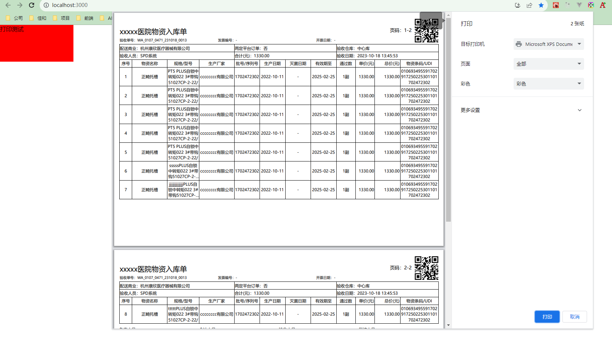

### yarn 或 npm i 安装依赖

### yarn start 或 npm run start 启动项目
我写了一个默认的列表字段配置、以及列表数据。列表的每一列都是可配置化的，包括打印单头部、表格头、页签
I wrote a default list field configuration, as well as list data. Each column of the list is configurable, including print headers, table headers, and tabs

